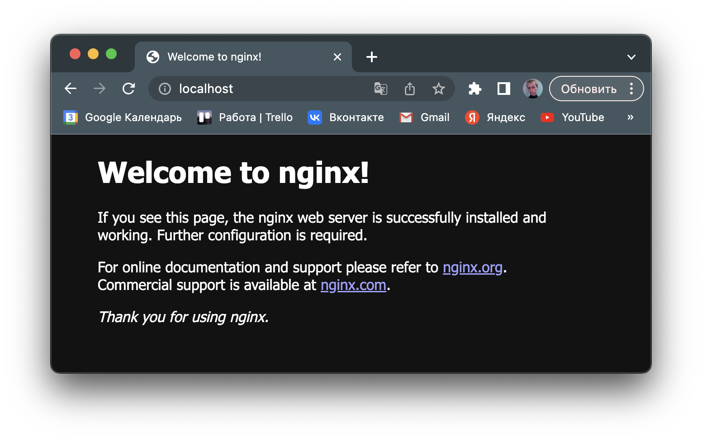
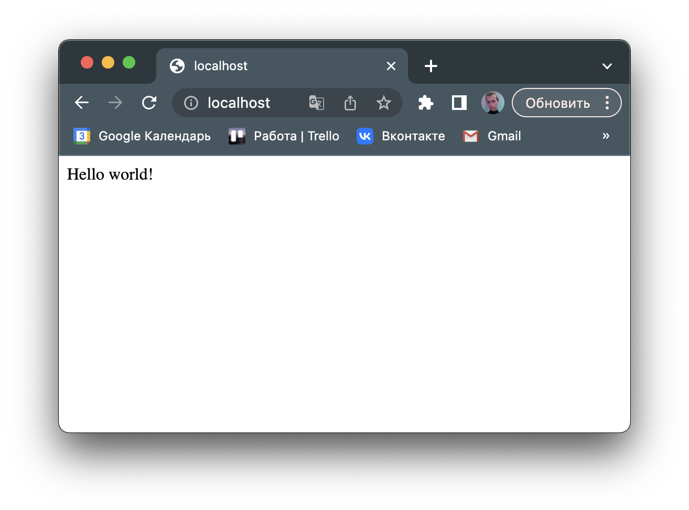

# Simple Docker

Введение в докер. Разработка простого докер образа для собственного сервера.

## Part 1. Готовый докер

### Выкачиваю образ `nginx`

  ``` shell
  docker pull nginx
  ```

    

### Проверяю наличие образа

  ``` shell
  docker images
  ```

    

### Запукаю образ в тихом режиме

  ``` shell
  docker run -d --name enginx nginx
  ```

    

### Проверяю, что образ запустился

  ``` shell
  docker ps
  ```

    

### По выводу команды определить и поместить в отчёт размер контейнера, список замапленных портов и ip контейнера

### Размер контейнера в байтах

  ``` shell
  docker inspect --size enginx | grep -i size
  ```

    

### Порты контейнера

  ``` shell
  docker inspect enginx | grep -i ports -A 1
  ```

    

### ip-адрес контейнера

  ``` shell
  docker inspect enginx | grep -i ipaddress
  ```

    

### Остановил контейнер

  ``` shell
  docker stop enginx
  ```

    

### Контейнер действительно остановился

    
***

### Запустил контейнер с портами 80 и 443

  ``` shell
  docker run --name enginxxx -d -p 80:80 -p 443:443 nginx
  ```

    

### Cтартовая страница `nginx` доступна

    

### Перезапустил докер контейнер

  ``` shell
  docker restart enginxxx
  ```

    

### Контейнер запустился и работает

    

## Part 2. Операции с контейнером

### Содержимое файла `nginx.conf`

  ``` shell
  docker exec enginxxx cat /etc/nginx/nginx.conf
  ```

    

### Настроил конфигурационный файл `nginx`

    

### Скопировал файл `nginx.conf` внутрь docker-контейнера c помощью команды

  ```shell
    docker cp /etc/nginx/nginx.conf enginxxx:/etc/nginx/
  ```

    

### Перезапустил `nginx` внутри докер образа через команды

  ```shell
    docker exec enginxxx nginx -t
    docker exec enginxxx nginx -s reload
  ```

  

### Страничка статус работает

  

### Экспортировал контейнер в файл `container.tar` с помощью команды

  ```shell
    docker export -o container.tar enginxxx
  ```

  

### Остановил контейнер enginxxx

  

### Удалил образ `nginx`

  ```shell
    docker rmi -f nginx
  ```

  

### Удалил остановленный контейнер

  

### Импортировать контейнер обратно с помошью команды

  ```shell
    sudo docker import -c 'CMD ["nginx", "-g", "daemon off;"]' container.tar new_nginx:latest
  ```

  

### Запустил импортированный контейнер

  

### Страничка статуса доступна

  

## Part 3. Мини веб-сервер

### Написал программку на `C` и `FCGI`

  

### Так как используется библиотека `fcgiapp.h`, то потребовался запуск только бинарного файла, не через `spawn-fcgi`. Файл был запущен в фоновом режиме

  

### Содержимое `nginx.conf`

  

### В браузере отображается написанная страничка

  

## Part 4. Свой докер

### Содержимое `Dockerfile`

  

### Собираю `Dockerfile` с помощью команды

  ```shell
    docker build -t fcgi_c:v1.0 . -f Dockerfile 
  ```

  

### Образ собрался корректно, добавился в список

  

### Запустил контейнер с помощью команды

  ```shell
  docker run --name teod -d -p 443:81 -p 80:81 -v /home/teod/nginx/nginx.conf:/etc/nginx/nginx.conf fcgi_c:v1.0
  ```

  

### Страничка по адресу `localhost:80` доступна

  

### Страничка по адресу `localhost:80/status` доступна

  

## Part 5. **Dockle**

### Созданный ранее докер образ был просканирован, `Dockle` выдал следующие ошибки

  

### Все ошибки были исправлены

  

### Однако, поменялся и `Dockerfile`

  

## Part 6. Базовый `Docker Compose`

### Содержимое файла `docker-compose.yaml`

  

### Cодержимое файла `nginx.conf` для контейнера server

  

### Cодержимое файла `nginx.conf` для контейнера app

  

### Собираю и поднимаю контейнеры с помощью команд

```shell
  docker-compose build
  docker-compose up -d
```

  

### Страничка по адресу `localhost:80` работает

  
